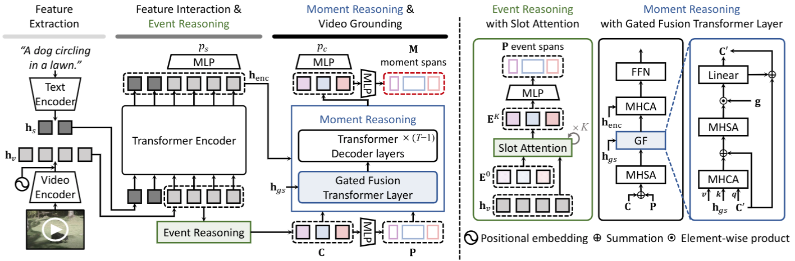

# EaTR (ICCV 2023)

This repository provides the official PyTorch implementation of the ICCV 2023 paper:
> **Knowing Where to Focus**: Event-aware Transformer for Video Grounding \[[arXiv](https://arxiv.org/abs/2308.06947)\]<br>
> [Jinhyun Jang](https://jinhyunj.github.io/), [Jungin Park](https://park-jungin.github.io/), [Jin Kim](https://genie-kim.github.io/), [Hyeongjun Kwon](https://kwonjunn01.github.io/), [Kwanghoon Sohn](http://diml.yonsei.ac.kr/professor/)<br>
> [Yonsei University](https://www.yonsei.ac.kr/sc/index.jsp)


<p align="center">
  
</p>


## Prerequisites

<b>0. Clone this repo.</b>

<b>1. Install dependencies.</b>

We trained and evaluated our models with Python 3.7 and PyTorch 1.12.1.
```
# create conda env
conda create --name eatr python=3.7
# activate env
conda actiavte eatr
# install pytorch
conda install pytorch torchvision torchaudio cudatoolkit=11.0 -c pytorch
# install other python packages
pip install tqdm ipython easydict tensorboard tabulate scikit-learn pandas
```

<b>2. Prepare datasets.</b>

- [QVHighlights](https://drive.google.com/file/d/1Hiln02F1NEpoW8-iPZurRyi-47-W2_B9/view?usp=sharing) from [Moment-DETR](https://github.com/jayleicn/moment_detr)
- [Charades-STA](https://app.box.com/s/h0sxa5klco6qve5ahnz50ly2nksmuedw/folder/138545516584) from [IA-Net](https://github.com/liudaizong/IA-Net)
- [ActivityNet Captions](http://activity-net.org/challenges/2016/download.html#c3d)

Download and extract each features under '../data/${dataset}/features/' directory.<br>
The files are organized in the following manner:
```
EaTR
├── data
│   ├── qvhighlights
│   │   ├── *features
│   │   ├── highlight_{train,val,test}_release.jsonl
│   │   └── subs_train.jsonl
│   ├── charades
│   │   ├── *features
│   │   └── charades_sta_{train,test}_tvr_format.jsonl
│   └── activitynet
│       ├── *features
│       └── activitynet_{train,val_1,val_2}.jsonl
├── models
├── utils
├── scripts
├── README.md
├── train.py
└── ···
```


## Training

Training can be launched by running the following command:
```
bash eatr/scripts/train.sh 
```

## Inference
Once the model is trained, you can use the following command for inference:
```
bash eatr/scripts/inference.sh ${path-to-ckeckpoint} ${split-name}  
``` 
${split-name} can be one of `val` and `test`.

## Citation
```
@inproceedings{Jang2023Knowing,
  title={Knowing Where to Focus: Event-aware Transformer for Video Grounding},
  author={Jang, Jinhyun and Park, Jungin and Kim, Jin and Kwon, Hyeongjun and Sohn, Kwanghoon},
  booktitle={Proceedings of the IEEE/CVF International Conference on Computer Vision},
  year={2023}
}
```
